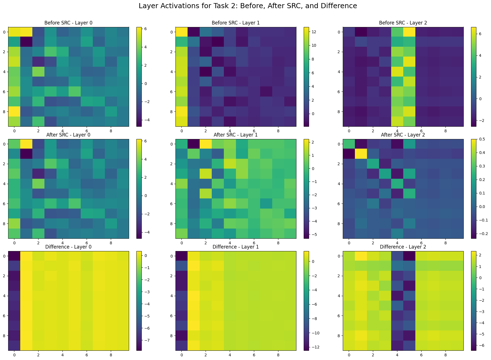
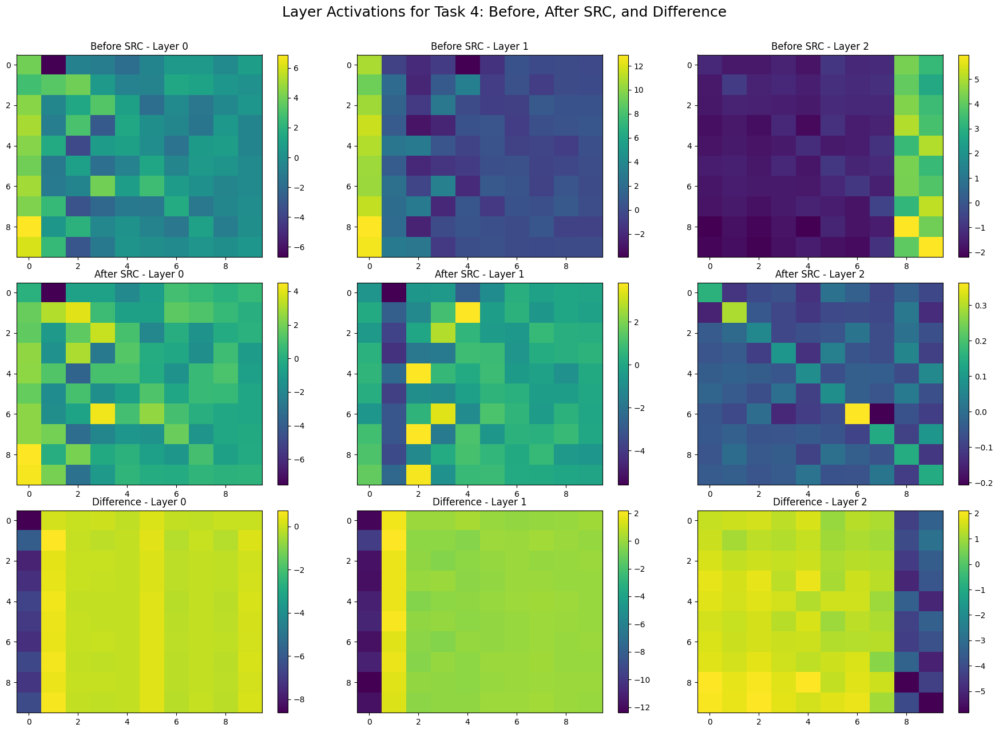
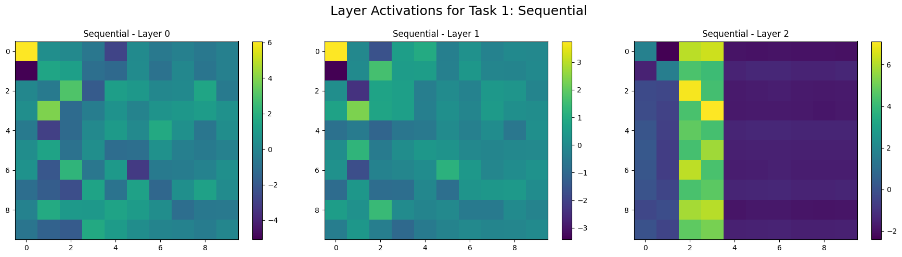
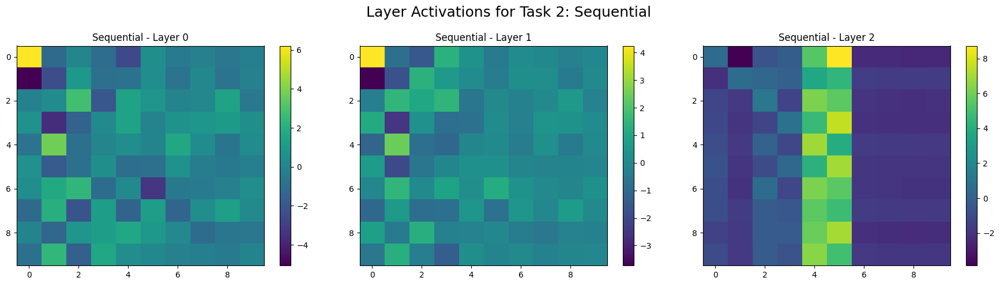
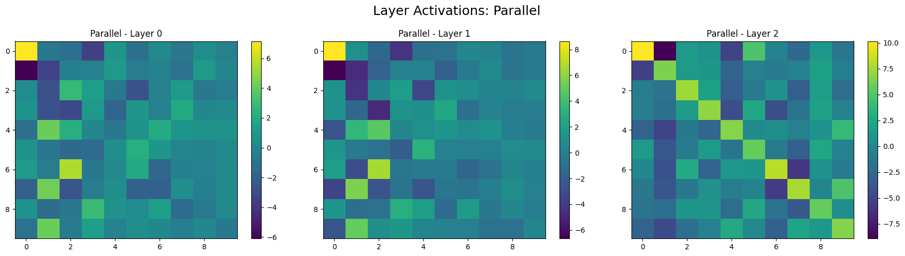

# Sleep Replay Consolidation (SRC) - Python

GitHub Repo: https://github.com/agbld/sleep-replay-consolidation-python

This is a replicate of the original implementation of the Sleep Replay Consolidation (SRC) algorithm in Python. The original implementation [tmtadros/SleepReplayConsolidation](https://github.com/tmtadros/SleepReplayConsolidation.git) was in MATLAB and was used in the following paper:
* Tadros, T., Krishnan, G. P., Ramyaa, R., & Bazhenov, M. (2022a). *Sleep-like unsupervised replay reduces catastrophic forgetting in artificial neural networks*. Nature Communications, 13(1). https://doi.org/10.1038/s41467-022-34938-7

## TODO

- [ ] Figure out the formula of `alpha` and `beta` in the SRC algorithm. 
  - [ ] See *Sleep Replay Consolidation (SRC) algorithm* part under *Methods* section in the paper. 
  - [ ] Also see [*Fast-classifying, high-accuracy spiking deep networks through weight and threshold balancing*](https://ieeexplore.ieee.org/document/7280696) (IJCNN 2015) for the exact scaling algorithm.
- [ ] Implement model merging and compare it with SRC.
- [ ] Extract the PCA component importance and use it to calculate the model capacity "usage" of each task. Observe how SRC reallocates model capacity during incremental learning.
- [ ] Solve the bias problem.
  - [ ] Figure out the current bias scaling algorithm.
  - [ ] If it indeed only do the scaling and won't modify during sleep phase, then the following problem might occur.
    * In a NN, there are two types of major parameters: weights and biases. Each of them play crucial roles while learning. Optimizer used in the training phase will try its best to adjust both weights and biases to fit on current task.
    * According to observation, so far, SRC do the "recall" or "memories recovery" things by **selectively adjusting the weights**. SRC seek to find a best compromised weights across all tasks. However, the **bias distribution may shift across tasks** as well.
    * If the target tasks are somehow **"bias-sensitive"**, then the SRC might **suffer from the "outdated" bias**, resulting in the catastrophic forgetting again.

## Experiments

### MNIST

The `mnist_exp.py` script try to replicate the original experiment ([see here!](https://github.com/tmtadros/SleepReplayConsolidation/blob/main/MNIST/run_class_task_summary.m)) on the MNIST dataset. Using the SRC algorithm ([see here!](https://github.com/tmtadros/SleepReplayConsolidation/blob/main/sleep/sleepnn_old.m)) that originally implemented in MATLAB.

#### Accuracy

#### Neuron Activity Visualization

The following visualizations show the activations for each model across different tasks in sequence.

Each row of subplots contains three subplots, each representing a layer, with Layer 0 on the left through Layer 2 (the output layer) on the right.

In each subplot, the **x-axis** represents different ten **"neuron clusters"**. PCA is applied to reduce the dimensionality of each layer's activations from 4000 to 10. The **PCA projection matrices** are **aligned under the same layer in the same task**, but **differ across tasks** due to the nature of PCA. Note that the **last layer (Layer 2)** shows raw activation values **without PCA**, as it already consists of 10 dimensions. The **y-axis** represents the **input indices**, which are ordered by class index from top to bottom as class 0, class 1, ..., class 9. Each class contains 1000 samples.

##### SRC - Before, After, and Difference

##### Sequential Learning (Lower Bound)

##### Parallel Learning (Upper Bound)

<!-- ### Ideas
* Instead of using a **fixed amount** for increasing or decreasing, a slight **"step-back"** to the previous model state (before SRC) might be better. (?)
    * According to the dynamics of visualized activations, the SRC algorithm **does not** seem to actually "recover" lost memories. 
    * Instead, it **selectively "cancels" the model's ability** on the current task and makes the model **"less focused" on the current task**. 
    * SRC causes the model to be **less confident** in everything, especially newly learned tasks. -->