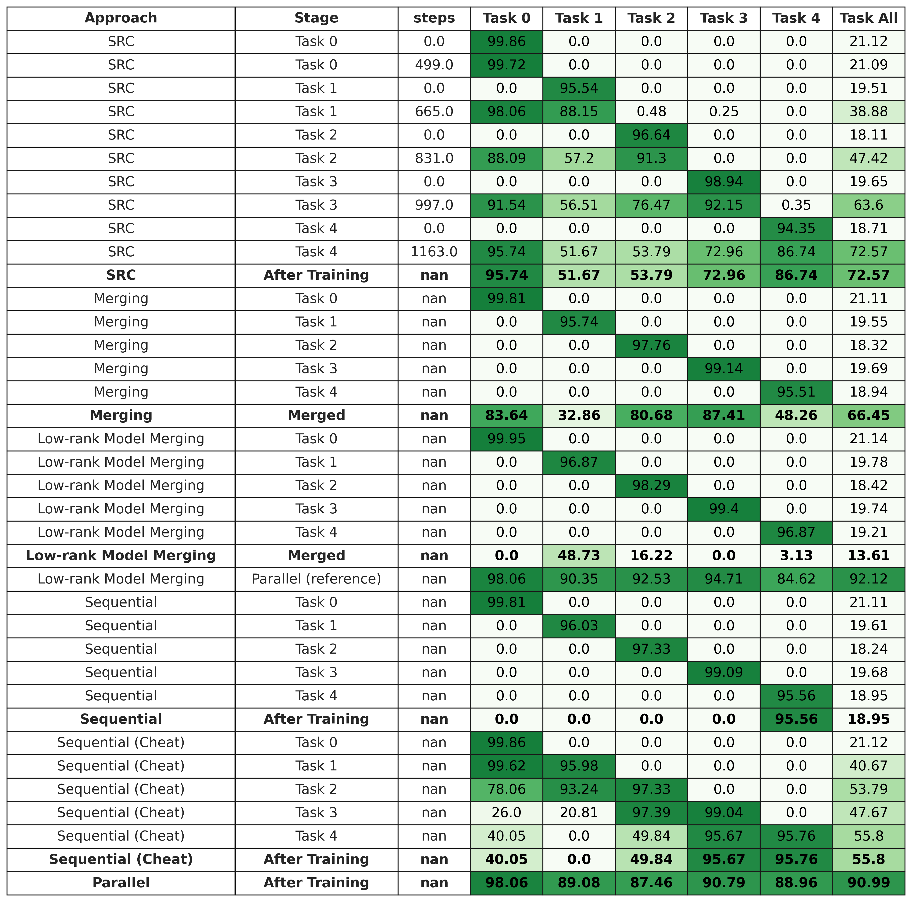
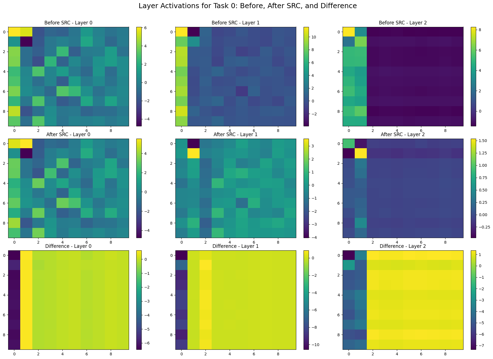
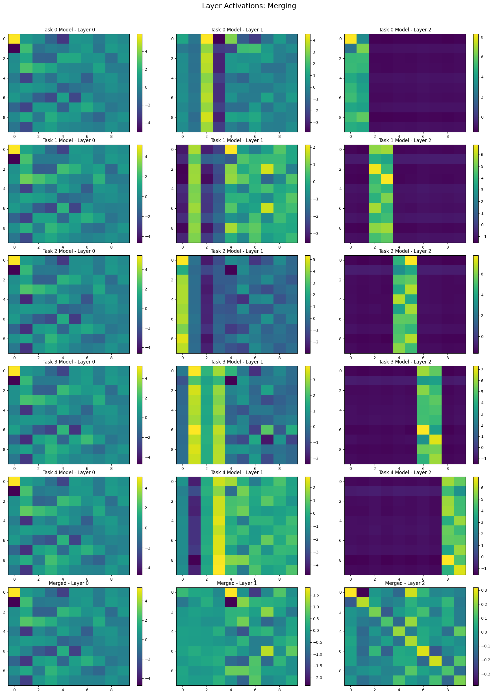
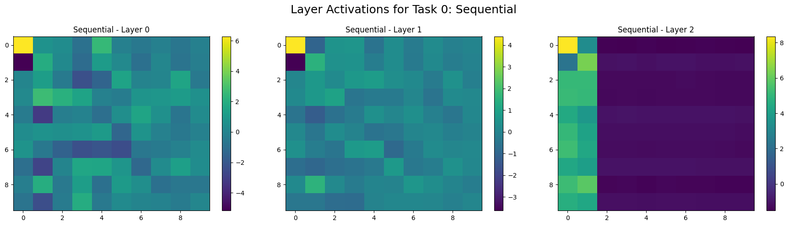
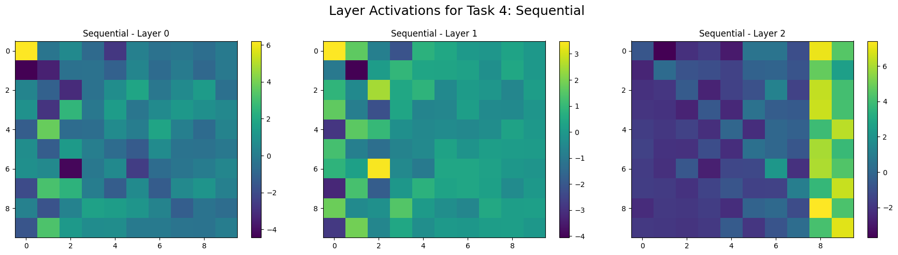

# Sleep Replay Consolidation (SRC) - Python

GitHub Repo: https://github.com/agbld/sleep-replay-consolidation-python

This is a Python replica of the original implementation of the Sleep Replay Consolidation (SRC) algorithm, as proposed in [*Sleep-like unsupervised replay reduces catastrophic forgetting in artificial neural networks*](https://doi.org/10.1038/s41467-022-34938-7) (Nature Communications) by Tadros et al., 2022.

The SRC algorithm is designed to mitigate catastrophic forgetting in artificial neural networks by consolidating knowledge across tasks during sleep phases.

The original implementation, [tmtadros/SleepReplayConsolidation](https://github.com/tmtadros/SleepReplayConsolidation.git), was written in MATLAB.

## Installation

1. Clone the repository:
    ```bash
    git clone https://github.com/agbld/sleep-replay-consolidation-python.git
    cd sleep-replay-consolidation-python
    ```

2. Make sure you have PyTorch installed. You can find the installation instructions on the [official PyTorch website](https://pytorch.org/get-started/locally/).

3. Install the required packages:
    ```bash
    pip install -r requirements.txt
    ```

4. (optional) Run all experiments with [VSCode Python Interactive window](https://code.visualstudio.com/docs/python/jupyter-support-py). Since the entire project is developed and run with this extension, it is recommended to use it for a better experience. (eg. matplotlib)

<details>
  <summary>Research Notes</summary>

#### TODO
- [ ] Figure out the formula for `alpha` and `beta` in the SRC algorithm.
  - [ ] See the *Sleep Replay Consolidation (SRC) algorithm* section under the *Methods* section in the paper.
  - [ ] Also see [*Fast-classifying, high-accuracy spiking deep networks through weight and threshold balancing*](https://ieeexplore.ieee.org/document/7280696) (IJCNN 2015) for the exact scaling algorithm.
- [x] Implement *model merging* approach and compare it with SRC.
- [ ] Extract the PCA component importance and use it to calculate the model capacity "usage" of each task. Observe how SRC reallocates model capacity during incremental learning.
- [ ] Solve the bias problem.
  - [ ] Currently, the bias is **disabled** in both the official and this Python implementation. However, the paper mentions that the bias is **scaled** during the sleep phase, which means the algorithm should be able to handle the bias as well.
  - [ ] Figure out the current bias scaling algorithm.
  - [ ] If it indeed only does the scaling and won't modify biases during the sleep phase, then the following problems might occur:
    * In a neural network (NN), there are two major types of parameters: weights and biases. Each of them plays a crucial role while learning. The optimizer used in the training phase will try its best to adjust both weights and biases to fit the current task.
    * According to observations, so far, SRC does the "recall" or "memory recovery" by **selectively adjusting the weights**. SRC seeks to find the best compromised weights across all tasks. However, the **bias distribution may shift across tasks** as well.
    * If the target tasks are somehow **"bias-sensitive"**, then SRC might **suffer from the "outdated" bias**, resulting in catastrophic forgetting again.

#### Questions
1. What decides whether we enable the bias in NN? eg. Phi-3.5 and Gemma 2 **disabled** bias but BERT-base was **enabled**.

</details>

## SRC Algorithm

The following equations try to describe the SRC algorithm in a more detailed manner. All of the following equations are based on the original paper and the MATLAB implementation. Please note that these equations are **NOT official** and might not be 100% accurate.

### Update Rules

#### Input Layer:
The processed input vector $h_0$ is directly assigned and contains only 0s and 1s, representing spikes or no spikes:

$$h_0 = \text{processed input vector} \in \{0, 1\}^n$$

#### Activation Function:
For each subsequent layer $\ell > 0$, the activation vector $h_{\ell}$ is computed using a **Heaviside step function** with threshold $\beta_{\ell-1}$:

$$h_{\ell} = \Theta\left(\alpha_{\ell-1} \cdot W_{\ell} \times h_{\ell-1} - \beta_{\ell-1}\right)$$
  
where:
- $W_{\ell}$: Weight matrix at layer $\ell$,
- $\alpha_{\ell-1}$: Scaling factor,
- $h_{\ell-1}$: Activation from previous layer.

#### Weight Update Rule:
The weight delta $\Delta W_{\ell}$ is computed using both increment and decrement factors:

$$\Delta W_{\ell} = \left( \text{inc} \cdot h_{\ell} \times h_{\ell-1}^{\top} \right) \odot W_{\ell}^{t} - \left( \text{dec} \cdot h_{\ell} \times \left(1 - h_{\ell-1}^{\top}\right) \right) \odot W_{\ell}^{t}$$
  
where:
- $\text{inc}$: Increment factor,
- $\text{dec}$: Decrement factor.

The weights are then updated iteratively as follows:

$$W_{\ell}^{t+1} = W_{\ell}^{t} + \Delta W_{\ell}$$

## Experiments

Following are the experiments conducted solely on this Python implementation.

### MNIST

The `mnist_exp.py` script try to replicate the original experiment ([see here!](https://github.com/tmtadros/SleepReplayConsolidation/blob/main/MNIST/run_class_task_summary.m)) on the MNIST dataset. Using the SRC algorithm ([see here!](https://github.com/tmtadros/SleepReplayConsolidation/blob/main/sleep/sleepnn_old.m)) that originally implemented in MATLAB.

#### Accuracy



#### Model Capacity Analysis

We use the stable rank to approximate the model's capacity usage. The stable rank is calculated by the following formula:

$$\text{Stable Rank of } W = \left( \frac{\|W\|_F}{\|W\|_2} \right)^2$$

where $\|W\|_F$ is the Frobenius norm and $\|W\|_2$ is the spectral norm of the weight matrix $W$. Or, as I understand it, in a more intuitive way, the stable rank is calculated by dividing the total importance of the components in the weight matrix by the importance of the most significant component.

By calculating the stable rank of the weight matrices of each layer, we can estimate the effective rank of these matrices—that is, how many singular values significantly contribute to the weight matrix. A **higher stable rank** implies that the singular values are more uniformly distributed, indicating that more singular components are substantially influencing the matrix. Consequently, the model may be **utilizing more of its capacity**.

In our hypothesis, the SRC algorithm should be able to compress the capacity usage of the current task, resulting in a **lower stable rank** while still **maintaining performance on the current task**.

The following figure shows the stable rank of each layer across different tasks.


#### Neuron Activity Visualization

The following visualizations show the activations for each model across different tasks in sequence.

Each row of subplots contains three subplots, each representing a layer, with Layer 0 on the left through Layer 2 (the output layer) on the right.

In each subplot, the **x-axis** represents different ten **"neuron clusters"**. PCA is applied to reduce the dimensionality of each layer's activations from 4000 to 10. The **PCA projection matrices** are **aligned under the same layer in the same task**, but **differ across tasks** due to the nature of PCA. Note that the **last layer (Layer 2)** shows raw activation values **without PCA**, as it already consists of 10 dimensions. The **y-axis** represents the **input indices**, which are ordered by class index from top to bottom as class 0, class 1, ..., class 9. Each class contains 1000 samples.

##### Sleep Replay Consolidation (SRC)

Each group of subplots shows the transitions of activations for each task. Here are brief explanations for each row:

1. **Before SRC**: The activations right **after training** on the current task and **before applying the SRC algorithm**.
2. **After SRC**: The activations right **after training** and **after applying the SRC algorithm**.
<!-- 3. **Synthetic**: This is a custom synthetic model created to verify our hypothesis. According to the authors' claim, SRC will *"strengthen important synaptic connections and prune irrelevant ones"*. This effect is very similar to a popular research topic in machine learning known as ***network pruning***. By using this simple synthetic model, we can get a glimpse of what SRC actually does. The synthetic model is created by the following process:
   1. Take a snapshot of the weight of model **before training** on the current task, denoted as $W_{\text{before}}$.
   2. Train the model on the current task. Then take another snapshot of the weight, denoted as $W_{\text{after}}$.
   3. Apply the SRC algorithm to the model and get the new weight, denoted as $W_{\text{SRC}}$.
   4. Calculate the difference between $W_{\text{after}}$ and $W_{\text{SRC}}$, denoted as $\Delta W_{\text{SRC}}$.

      $$\Delta W_{\text{SRC}} = W_{\text{SRC}} - W_{\text{after}}$$

   5. Finally, the weight of the synthetic model is calculated as follows:

      $$W_{\text{synthetic}} = W_{\text{before}} + \Delta W_{\text{SRC}}$$

      We then use the $W_{\text{synthetic}}$ initialized the synthetic model. -->
3. **Difference**: The difference between the activations **before and after SRC algorithm**. This is also used for observing the effect of SRC on the model.




According to the comparison between the **Before SRC** and **After SRC** models, especially the distributions in layer 2 (i.e., the output layer), we can see that the model does not actually forget the previous tasks. Instead, it seems to give too much "attention" to the current task and "forgets" the previous tasks. This is a clear sign of catastrophic forgetting. Through SRC, it inhibits the less important weights used for the current task, which might also act as "noise" (a very loud one) to the previous tasks, resulting in the "recovery" of the previous tasks.

<!-- Additionally, by observing the **synthetic model**, we can see that the output distributions are **very similar to those of the After SRC model** for the last task, but the **neurons related to the current task are noticeably less active**. For instance, when comparing the synthetic model from task 4 with the After SRC model from task 3, we can see that the two rightmost neurons, i.e., the 8th and 9th neurons, in the synthetic model are dimmer than those in the After SRC model. -->

##### Model Merging (Average)

In this experiment, task-specific models are trained independently on different tasks from the same checkpoint (i.e., the same initial weights). After training, the models are merged by averaging their weights.



##### Sequential Learning (Lower Bound)






##### Parallel Learning (Upper Bound)


<!-- ### Ideas
* Instead of using a **fixed amount** for increasing or decreasing, a slight **"step-back"** to the previous model state (before SRC) might be better. (?)
    * According to the dynamics of visualized activations, the SRC algorithm **does not** seem to actually "recover" lost memories. 
    * Instead, it **selectively "cancels" the model's ability** on the current task and makes the model **"less focused" on the current task**. 
    * SRC causes the model to be **less confident** in everything, especially newly learned tasks. -->
