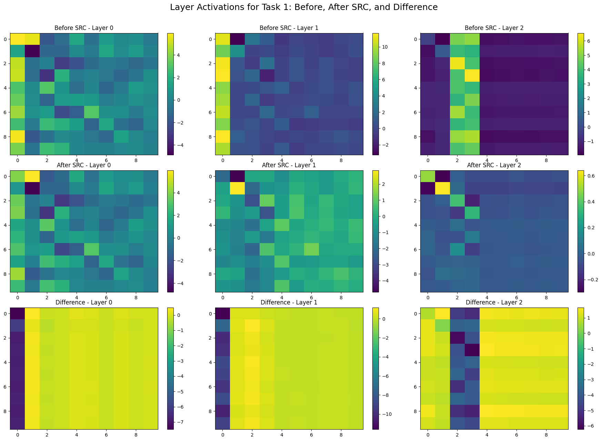
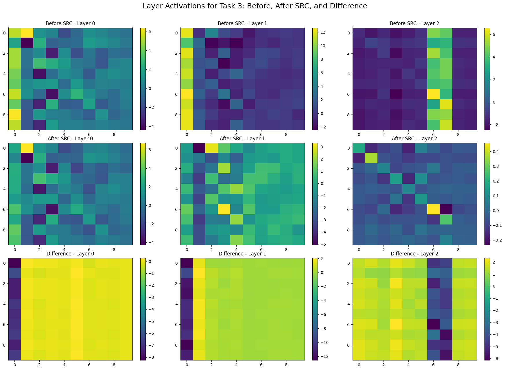

# Sleep Replay Consolidation (SRC) - Python

This is a replicate of the original implementation of the Sleep Replay Consolidation (SRC) algorithm in Python. The original implementation [tmtadros/SleepReplayConsolidation](https://github.com/tmtadros/SleepReplayConsolidation.git) was in MATLAB and was used in the following paper:
* Tadros, T., Krishnan, G. P., Ramyaa, R., & Bazhenov, M. (2022a). *Sleep-like unsupervised replay reduces catastrophic forgetting in artificial neural networks*. Nature Communications, 13(1). https://doi.org/10.1038/s41467-022-34938-7

[TOC]

## Experiments

### MNIST

The `mnist_exp.py` script try to replicate the original experiment ([see here!](https://github.com/tmtadros/SleepReplayConsolidation/blob/main/MNIST/run_class_task_summary.m)) on the MNIST dataset. Using the SRC algorithm ([see here!](https://github.com/tmtadros/SleepReplayConsolidation/blob/main/sleep/sleepnn_old.m)) that originally implemented in MATLAB.

#### Accuracy

#### Neuron Activity Visualization

The following visualizations show the activations for each model across different tasks in sequence.

Each row of subplots contains three subplots, each representing a layer, with Layer 0 on the left through Layer 2 (the output layer) on the right.

In each subplot, the **x-axis** represents different ten **"neuron clusters"**. PCA is applied to reduce the dimensionality of each layer's activations from 4000 to 10. The **PCA projection matrices** are **aligned under the same layer in the same task**, but **differ across tasks** due to the nature of PCA. Note that the **last layer (Layer 2)** shows raw activation values **without PCA**, as it already consists of 10 dimensions. The **y-axis** represents the **input indices**, ordered from top to bottom as Task 0, Task 1, ... Task 4. Each task contains 1000 samples.

##### SRC - Before, After, and Difference

##### Parallel Learning (Upper Bound)

